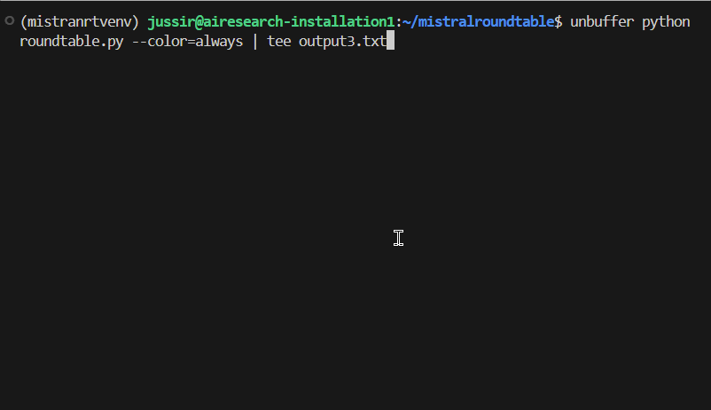

# AI Agent Roundtable

This is a simple script that sets up a roundtable of AI agents for a discussion of the given questions.



*An example of agents discussing*

## Description

The script works by building prompts that guide the discussion and keep it and the personas on track and produces "content" by doing completion requests to an OpenAI compatible API large language model (LLM) AI endpoint.

The agent personas are described in the `participant/roleN.json` files, where `N` must start from 1 and increase consecutively until enough roles are defined. Each of these role JSON files defines an object with fields `"name"`, `"full_name"`, `"creativity"`, and `"prompt"`. Here, the `"creativity"` should be a float from the range of 0.0 to 1.0. It basically controls the temperature of the LLM. Lower the creativity, the more conservative the output is. Furthermore, the `"prompt"` should start with `"You, as an AI assistant, will take the role of"` or something similar. See the folder for examples.

The context for the roundtable discussion and the questions the roundtable discusses are stored in the `task/` folder. Feel free to edit `context.txt`, `instructions.txt`, and `questions.txt` as you see fit.

Finally, there are some settings in the beginning of the main `roundtable.py` script. These define, e.g., how long certain topics are discussed, how often the participants are prompted to ask the opinion of others, how long the discussion should continue, and so on.

## Getting Started

The roundtable requires two parts to be running simultaneously:

1. A server serving OpenAI compatible LLM completions API.
2. The main `roundtable.py` script.

For test purposes, there is also a `test/dummyllmserver.py`. This uses **flask** and **markovify** to implement a minimal language completion server based on a Markov chain text generation model built from the sentences of the prompt.

For actual use, there is a `modelup.sh` script to run **Mistral-7B-Instruct-v0.2** model locally on your machine.

To be more specific, the script `modelup.sh` runs a **docker** command that pulls a **vllm** image that serves the latest **Mistral-7B-Instruct-v0.2** model through an API on port 8000. The model is loaded from Hugging Face, and, therefore, before running the `modelup.sh` script you need to:

1. Register and log in to Hugging Face.
2. Get your Hugging Face token. As of the time of writing this instruction, click your profile circle/icon in the top right corner of the Hugging Face website, choose *Settings*, go to *Access Tokens* on the left side list, generate *New token* or refresh an existing one. Copy it to the clipboard.
3. In the terminal session where you would like to run the LLM, set the `$HF_TOKEN` environment variable with:
   ```bash
   $ export HF_TOKEN=hf_<rest of your secret here>
   ```
4. Accept the terms and conditions on the Hugging Face model page: https://huggingface.co/mistralai/Mistral-7B-Instruct-v0.2 

Now, you can finally start serving the Mistral-7B-Instruct LLM:
```bash
$ sh modelup.sh
```

Good. Now, in a second terminal session, you can create a virtual Python environment (recommended) and then run the main roundtable script. Assuming you are in the `airoundtable` folder, run the following commands:

```bash
$ python3 -m venv .roundtable_venv
$ source .roundtable_venv/bin/activate
$ which pip # to verify that the venv pip is used
$ pip install openai colorama
$ pip install flask markovify # for the dummy server
```

## Dependencies 

Of the requirements, the `colorama` module is used to provide ANSI colors to make the terminal output look pretty, the `openai` module is used to provide a convenient way to use OpenAI compatible LLM APIs, and **docker** can be avoided if one uses third-party served models or some other way of serving an LLM model through an OpenAI compatible API.

The dummy minimal text completion server requires `flask` and `markovify` Python modules to be installed.

## License

This project is licensed under the MIT license - see the LICENSE file for details
